# Nothing Theme

Custom terminal/editor colorscheme based on the [Nothing design system](https://github.com/dominikmartn/nothing-design-skill).
Two variants: `nothing-light` (default) and `nothing-dark`.

## Preview

Sample terminal renders use the palettes documented below (accent `#FF4719`, warm neutrals, syntax roles). Refresh with `python3 scripts/generate-terminal-previews.py` (requires [Pillow](https://pypi.org/project/pillow/) and [JetBrainsMono Nerd Font Mono](https://www.nerdfonts.com/font-downloads)).

| Nothing Dark — The Crucible | Nothing Light — The Steam |
|:-:|:-:|
| 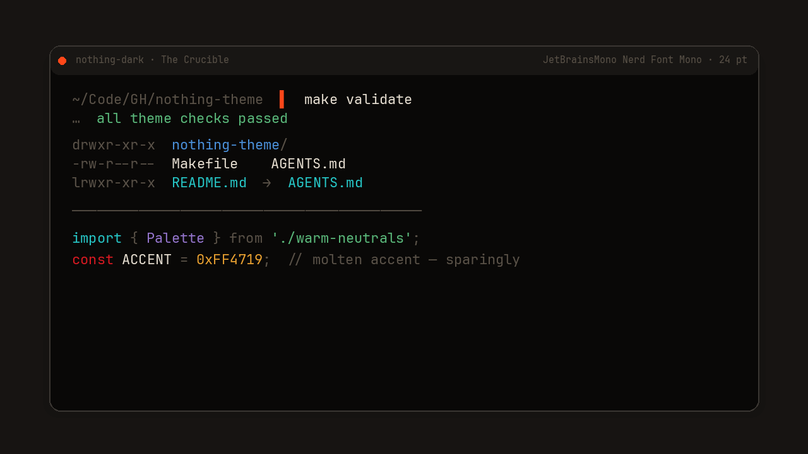 | 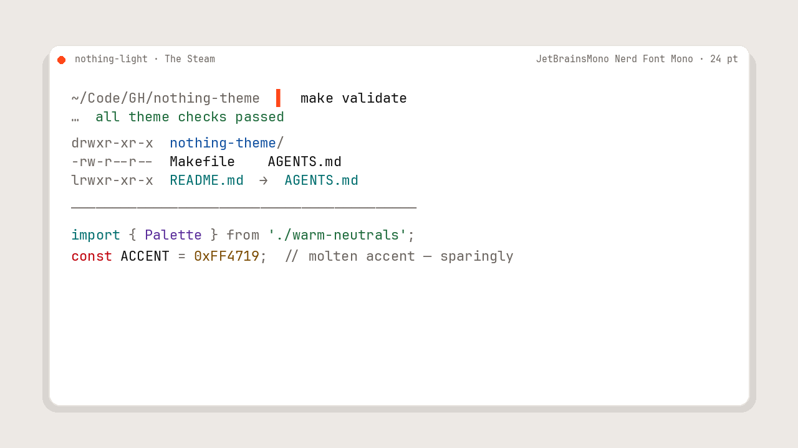 |

## Wallpaper Gallery

Solid-color Nothing Theme wallpapers are available in `assets/wallpapers/{dark,light}/`
at 3840x2160, 2560x1440, and 1920x1080. Small README thumbnails live in
`assets/gallery/`.

| Variant | Dark | Light |
|---|---|---|
| Recursive Void | 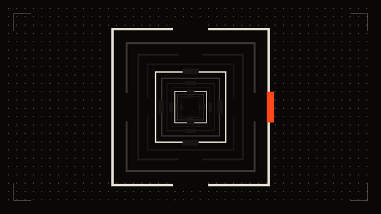 | 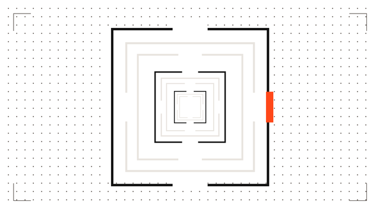 |
| Void Stairwell | 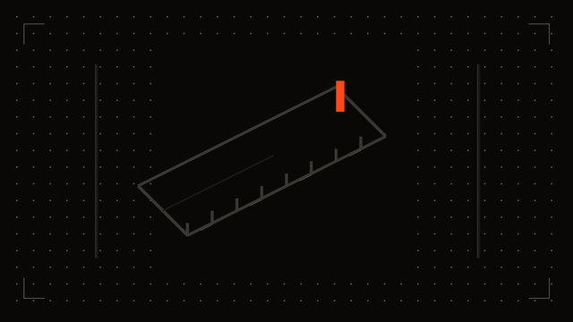 | 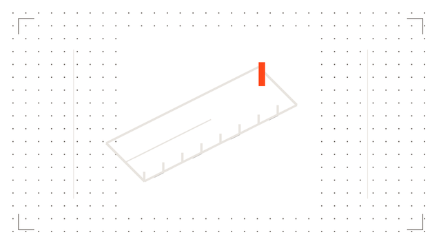 |
| Event Horizon Grid | 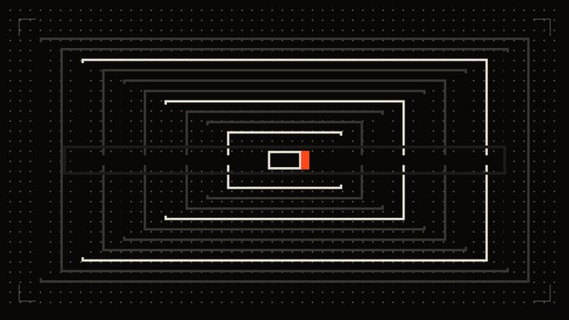 | 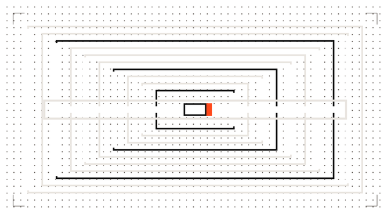 |
| Industrial Maze | 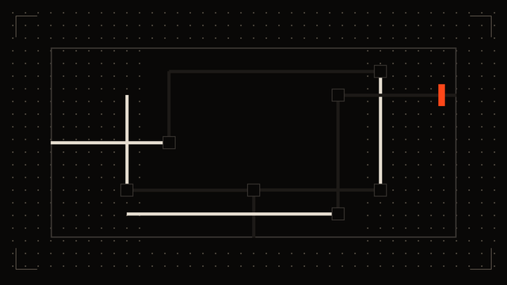 | 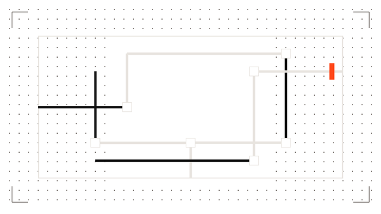 |
| Infinite Well | 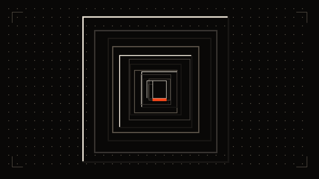 | 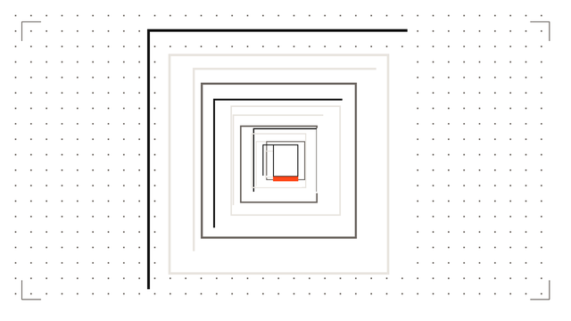 |

---

## Design principles

- Monochromatic, typographically driven — inspired by the Nothing design system: industrial precision, warm neutrals, color as an event not a default
- One molten accent (`#FF4719`) shared across both modes — used for the active window/pane indicator and cursor. Everything else is warm neutrals. In tmux, `#FF4719` fires only on `window-status-current` and `pane-active-border` — two locations per screen, never more
- Dark mode: OLED-ready near-black base (`#090807`) with warm parchment foreground (`#E5DDD0`)
- Light mode: pure white canvas (`#FFFFFF`) with all ANSI colors darkened for WCAG AA contrast (≥4.5:1). Light mode has no surface elevation (`surface = bg = #FFFFFF`) — floating windows are distinguished by border alone
- Normal and bright ANSI pairs are distinct — brights are lighter/more saturated variants, not duplicates
- Yellow on white is a trap: the light yellow is pulled to `#7A4A00` (readable amber-brown)
- Bright White (ANSI slot 15) in light mode is `#6B6560` — a medium warm gray, not white. This is intentional for WCAG compliance but breaks the slot's "maximum brightness" convention. Tools that hardcode slot 15 as high-contrast white will render muted gray instead
- `disabled` and `muted` share the same hex in both modes (`#5A5248` dark, `#6B6560` light). The semantic distinction is naming-only. Dark muted on dark bg (~3.0:1 contrast) intentionally falls below WCAG AA — comments and line numbers are meant to recede
- Typeface: JetBrainsMono Nerd Font Mono at 24pt

---

## Nothing Dark — The Crucible

> OLED black base. Warm parchment foreground. Color is an interrupt.

### Terminal special colors

| Role                 | Hex       | Swatch | Notes                              |
|----------------------|-----------|--------|------------------------------------|
| Background           | `#090807` |  | Near-OLED black, warm undertone    |
| Foreground           | `#E5DDD0` |  | Warm parchment white               |
| Cursor               | `#FF4719` |  | Molten orange-red — the accent     |
| Cursor text          | `#090807` |  |                                    |
| Selection background | `#1D1A17` |  | Slightly lifted from background    |
| Selection text       | `#E5DDD0` |  |                                    |
| Dim / Metadata       | `#5A5248` |  | ~50% — prompt decorators, labels   |
| Bold                 | `#FFFFFF` |  |                                    |
| Link                 | `#4A8FD9` |  |                                    |

### ANSI terminal palette

| Slot | Name           | Hex       | Swatch | RGB             |
|------|----------------|-----------|--------|-----------------|
| 0    | Black          | `#181614` |  | 24, 22, 20      |
| 1    | Red            | `#D71921` |  | 215, 25, 33     |
| 2    | Green          | `#5AB87A` |  | 90, 184, 122    |
| 3    | Yellow         | `#E8A030` |  | 232, 160, 48    |
| 4    | Blue           | `#4A8FD9` |  | 74, 143, 217    |
| 5    | Magenta        | `#9575CD` |  | 149, 117, 205   |
| 6    | Cyan           | `#26C6C6` |  | 38, 198, 198    |
| 7    | White          | `#E5DDD0` |  | 229, 221, 208   |
| 8    | Bright Black   | `#3A3632` |  | 58, 54, 50      |
| 9    | Bright Red     | `#FF3B3B` |  | 255, 59, 59     |
| 10   | Bright Green   | `#7DD89A` |  | 125, 216, 154   |
| 11   | Bright Yellow  | `#FFB84D` |  | 255, 184, 77    |
| 12   | Bright Blue    | `#70ADEC` |  | 112, 173, 236   |
| 13   | Bright Magenta | `#B39DDB` |  | 179, 157, 219   |
| 14   | Bright Cyan    | `#4DD9D9` |  | 77, 217, 217    |
| 15   | Bright White   | `#FFFFFF` |  | 255, 255, 255   |

### Neovim semantic color palette

| Role       | Hex       | Swatch | Usage                                      |
|------------|-----------|--------|--------------------------------------------|
| `bg`       | `#090807` |  | Editor background                           |
| `surface`  | `#181614` |  | Floating windows                            |
| `raised`   | `#1D1A17` |  | Cursor line, popups                         |
| `border`   | `#3A3632` |  | Borders, split lines                        |
| `split`    | `#3A3632` |  | Visual selection, pane dividers             |
| `disabled` | `#5A5248` |  | Comments (italic), disabled elements        |
| `muted`    | `#5A5248` |  | Operators, punctuation, line numbers        |
| `fg`       | `#E5DDD0` |  | Primary text, variables                     |
| `bright`   | `#FFFFFF` |  | Bold text, headings, maximum contrast       |
| `accent`   | `#FF4719` |  | Cursor, active indicator                    |
| `red`      | `#D71921` |  | Keywords, errors, deletions                 |
| `green`    | `#5AB87A` |  | Strings, additions, success                 |
| `yellow`   | `#E8A030` |  | Numbers, warnings, modified                 |
| `blue`     | `#4A8FD9` |  | Functions, links, directories               |
| `magenta`  | `#9575CD` |  | Types, classes, constants                   |
| `cyan`     | `#26C6C6` |  | Imports, namespaces, string escapes         |

---

## Nothing Light — The Steam

> Pure white canvas. All ANSI colors darkened for WCAG AA contrast (≥4.5:1).

### Terminal special colors

| Role                 | Hex       | Swatch | Notes                              |
|----------------------|-----------|--------|------------------------------------|
| Background           | `#FFFFFF` |  | Pure white                         |
| Foreground           | `#111111` |  | Near-black                         |
| Cursor               | `#FF4719` |  | Same molten accent as dark         |
| Cursor text          | `#FFFFFF` |  |                                    |
| Selection background | `#E8E4DF` |  | Warm light gray                    |
| Selection text       | `#111111` |  |                                    |
| Dim / Metadata       | `#6B6560` |  | 4.7:1 on white — WCAG AA           |
| Bold                 | `#000000` |  |                                    |
| Link                 | `#1050A0` |  |                                    |

### ANSI terminal palette

| Slot | Name           | Hex       | Swatch | RGB             |
|------|----------------|-----------|--------|-----------------|
| 0    | Black          | `#111111` |  | 17, 17, 17      |
| 1    | Red            | `#C0000A` |  | 192, 0, 10      |
| 2    | Green          | `#1E6B3C` |  | 30, 107, 60     |
| 3    | Yellow         | `#7A4A00` |  | 122, 74, 0      |
| 4    | Blue           | `#1050A0` |  | 16, 80, 160     |
| 5    | Magenta        | `#5A2D9A` |  | 90, 45, 154     |
| 6    | Cyan           | `#006E6E` |  | 0, 110, 110     |
| 7    | White          | `#3A3530` |  | 58, 53, 48      |
| 8    | Bright Black   | `#555050` |  | 85, 80, 80      |
| 9    | Bright Red     | `#E8001A` |  | 232, 0, 26      |
| 10   | Bright Green   | `#2A8A50` |  | 42, 138, 80     |
| 11   | Bright Yellow  | `#9A5E00` |  | 154, 94, 0      |
| 12   | Bright Blue    | `#1A6ACC` |  | 26, 106, 204    |
| 13   | Bright Magenta | `#7A40C0` |  | 122, 64, 192    |
| 14   | Bright Cyan    | `#008A8A` |  | 0, 138, 138     |
| 15   | Bright White   | `#6B6560` |  | 107, 101, 96    |

### Neovim semantic color palette

| Role       | Hex       | Swatch | Usage                                      |
|------------|-----------|--------|--------------------------------------------|
| `bg`       | `#FFFFFF` |  | Editor background                           |
| `surface`  | `#FFFFFF` |  | Floating windows (no lift in light mode)    |
| `raised`   | `#E8E4DF` |  | Cursor line, popups                         |
| `border`   | `#E8E4DF` |  | Borders — same as `raised`; `#F0EDE8` was invisible on white |
| `split`    | `#E8E4DF` |  | Visual selection, pane dividers             |
| `disabled` | `#6B6560` |  | Comments (italic), disabled elements        |
| `muted`    | `#6B6560` |  | Operators, punctuation, line numbers        |
| `fg`       | `#111111` |  | Primary text, variables                     |
| `bright`   | `#000000` |  | Bold text, headings, maximum contrast       |
| `accent`   | `#FF4719` |  | Cursor, active indicator                    |
| `red`      | `#C0000A` |  | Keywords, errors, deletions                 |
| `green`    | `#1E6B3C` |  | Strings, additions, success                 |
| `yellow`   | `#7A4A00` |  | Numbers, warnings, modified                 |
| `blue`     | `#1050A0` |  | Functions, links, directories               |
| `magenta`  | `#5A2D9A` |  | Types, classes, constants                   |
| `cyan`     | `#006E6E` |  | Imports, namespaces, string escapes         |

---

## Syntax highlighting mapping

These rules apply to both variants (swap colors for light vs dark per the tables above). Classic vim highlight groups and Neovim treesitter `@` semantic groups are both defined.

### Classic vim groups

| Syntax role              | Color role  | Notes                              |
|--------------------------|-------------|------------------------------------|
| Comment                  | `disabled`  | Italic                             |
| String                   | `green`     |                                    |
| String escape / interp   | `cyan`      |                                    |
| Number / Float           | `yellow`    |                                    |
| Boolean / Null           | `red`       |                                    |
| Constant                 | `magenta`   |                                    |
| Keyword / Control        | `red`       |                                    |
| Function name / call     | `blue`      |                                    |
| Type / Class             | `magenta`   |                                    |
| Variable / Identifier    | `fg`        |                                    |
| Property / Member        | `blue`      |                                    |
| Operator                 | `muted`     |                                    |
| Punctuation / Delimiter  | `muted`     |                                    |
| Tag name (HTML/JSX)      | `red`       |                                    |
| Tag attribute            | `magenta`   |                                    |
| Import / Namespace       | `cyan`      |                                    |
| Decorator                | `magenta`   |                                    |
| Regex                    | `red`       |                                    |
| Diff added               | `green`     |                                    |
| Diff removed             | `red`       |                                    |
| Diff changed             | `yellow`    |                                    |
| Error / Invalid          | `red`       | Bold                               |

### Neovim treesitter `@` semantic groups

| Treesitter group           | Color role  | Notes                              |
|----------------------------|-------------|------------------------------------|
| `@variable`                | `fg`        |                                    |
| `@variable.builtin`        | `red`       | `self`, `this`, etc.               |
| `@variable.parameter`      | `fg`        |                                    |
| `@variable.member`         | `blue`      | Struct/object fields               |
| `@string`                  | `green`     |                                    |
| `@string.escape`           | `cyan`      |                                    |
| `@string.special`          | `cyan`      |                                    |
| `@number` / `@number.float`| `yellow`    |                                    |
| `@boolean`                 | `red`       |                                    |
| `@constant`                | `magenta`   |                                    |
| `@constant.builtin`        | `red`       | `nil`, `true`, `false`             |
| `@constant.macro`          | `magenta`   |                                    |
| `@keyword`                 | `red`       |                                    |
| `@keyword.return`          | `red`       |                                    |
| `@keyword.function`        | `red`       |                                    |
| `@keyword.operator`        | `muted`     |                                    |
| `@keyword.import`          | `cyan`      |                                    |
| `@function` / `@function.call` | `blue`  |                                    |
| `@function.builtin`        | `blue`      |                                    |
| `@function.method` / `@function.method.call` | `blue` |               |
| `@constructor`             | `blue`      |                                    |
| `@type` / `@type.builtin`  | `magenta`   |                                    |
| `@type.definition`         | `magenta`   |                                    |
| `@attribute`               | `magenta`   | Decorators, annotations            |
| `@property`                | `blue`      |                                    |
| `@operator`                | `muted`     |                                    |
| `@punctuation.delimiter`   | `muted`     |                                    |
| `@punctuation.bracket`     | `muted`     |                                    |
| `@comment`                 | `disabled`  | Italic                             |
| `@tag`                     | `red`       | HTML/JSX tag names                 |
| `@tag.attribute`           | `magenta`   |                                    |
| `@tag.delimiter`           | `muted`     |                                    |
| `@module` / `@namespace`   | `cyan`      |                                    |
| `@regex`                   | `red`       |                                    |
| `@diff.plus`               | `green`     |                                    |
| `@diff.minus`              | `red`       |                                    |
| `@diff.delta`              | `yellow`    |                                    |

---

## iTerm2

Both Nothing variants are available for iTerm2:

| Variant | Color preset | Dynamic Profile |
|---------|--------------|-----------------|
| `nothing-light` | `home/.config/iterm2/colors/nothing-light.itermcolors` | `home/.config/iterm2/DynamicProfiles/nothing-light.json` |
| `nothing-dark` | `home/.config/iterm2/colors/nothing-dark.itermcolors` | `home/.config/iterm2/DynamicProfiles/nothing-dark.json` |

Import the `.itermcolors` files as iTerm2 color presets, or install the Dynamic Profile JSON files to `~/Library/Application Support/iTerm2/DynamicProfiles/` to load the named `Nothing Light` and `Nothing Dark` profiles.

Run `make install-iterm2` to install both Dynamic Profiles into iTerm2's watched directory and copy the color preset files into `~/.config/iterm2/colors/` for manual import. Use `PREFIX=/path/to/home` to install into another home-style directory.

---

## Ghostty

Both Nothing variants are available for Ghostty:

| Variant | Theme file |
|---------|------------|
| `nothing-light` | `home/.config/ghostty/themes/nothing-light` |
| `nothing-dark` | `home/.config/ghostty/themes/nothing-dark` |

Run `make install-ghostty` to install both themes into `~/.config/ghostty/themes/`. Use `PREFIX=/path/to/home` to install into another home-style directory. Both themes set `font-family = "JetBrainsMono Nerd Font Mono"` and `font-size = 24`. Install the font with `brew install --cask font-jetbrains-mono-nerd-font`.

Use a single variant:

```text
theme = nothing-light
```

```text
theme = nothing-dark
```

Or switch with the system appearance:

```text
theme = light:nothing-light,dark:nothing-dark
```

---

## CLI app themes

Bare `make` runs validation only. Run `make install` or `make deploy` to copy all managed iTerm2, Ghostty, tmux, Neovim, eza, delta, and lazygit theme artifacts. App-specific targets are also available:

| App | Install target | Light file | Dark file |
|-----|----------------|------------|-----------|
| tmux | `make install-tmux` | `home/.config/tmux/themes/nothing-light.conf` | `home/.config/tmux/themes/nothing-dark.conf` |
| Neovim | `make install-nvim` | `home/.config/nvim/colors/nothing-light.lua` | `home/.config/nvim/colors/nothing-dark.lua` |
| eza | `make install-eza` | `home/.config/eza/themes/nothing-light.yml` | `home/.config/eza/themes/nothing-dark.yml` |
| delta | `make install-delta` | `home/.config/delta/themes/nothing-light.gitconfig` | `home/.config/delta/themes/nothing-dark.gitconfig` |
| lazygit | `make install-lazygit` | `home/.config/lazygit/themes/nothing-light.yml` | `home/.config/lazygit/themes/nothing-dark.yml` |

### tmux

Install both variants into `~/.config/tmux/themes/`, then source the preferred variant from `~/.tmux.conf`:

```tmux
source-file ~/.config/tmux/themes/nothing-light.conf
```

```tmux
source-file ~/.config/tmux/themes/nothing-dark.conf
```

### Neovim

Install both colorschemes into `~/.config/nvim/colors/`, then select one explicitly:

```vim
colorscheme nothing-light
```

```vim
colorscheme nothing-dark
```

### eza

Install both YAML themes into `~/.config/eza/themes/`. eza loads `~/.config/eza/theme.yml`, so activate a variant by copying or symlinking the preferred file:

```sh
ln -sf ~/.config/eza/themes/nothing-light.yml ~/.config/eza/theme.yml
```

```sh
ln -sf ~/.config/eza/themes/nothing-dark.yml ~/.config/eza/theme.yml
```

### delta

Install both snippets into `~/.config/delta/themes/`, then include the preferred snippet from Git config and select its feature:

```gitconfig
[include]
    path = ~/.config/delta/themes/nothing-light.gitconfig
[delta]
    features = nothing-light
```

```gitconfig
[include]
    path = ~/.config/delta/themes/nothing-dark.gitconfig
[delta]
    features = nothing-dark
```

### lazygit

Install both snippets into `~/.config/lazygit/themes/`. Lazygit does not have a dedicated theme search path, so merge the preferred snippet into `~/.config/lazygit/config.yml` or copy its `gui.theme` block into the active config.

---

## License

This project is released under the [MIT License](LICENSE).
